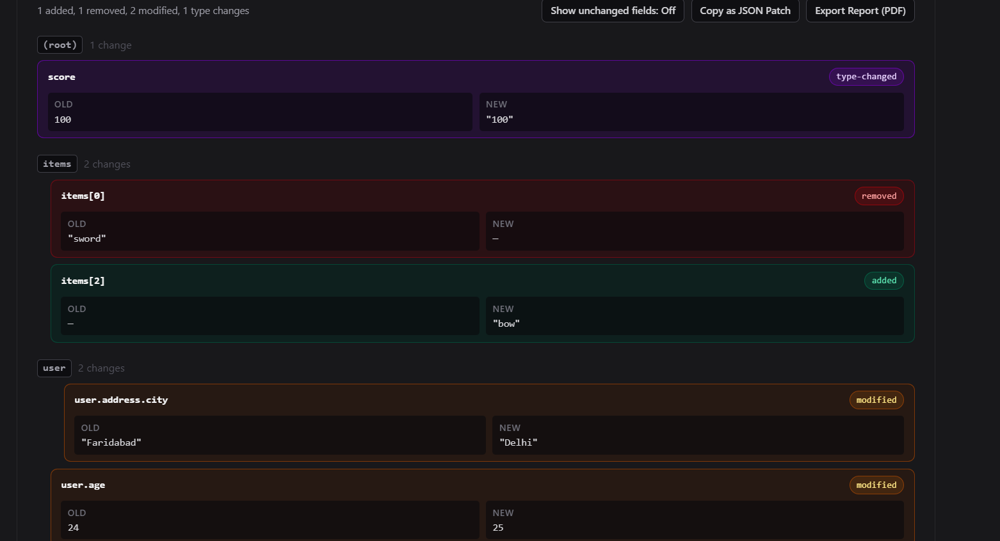
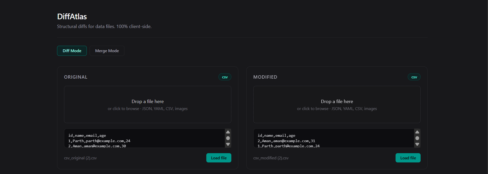
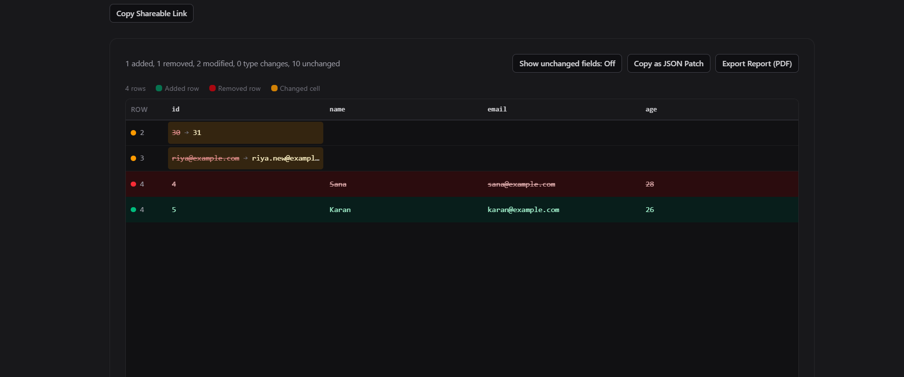
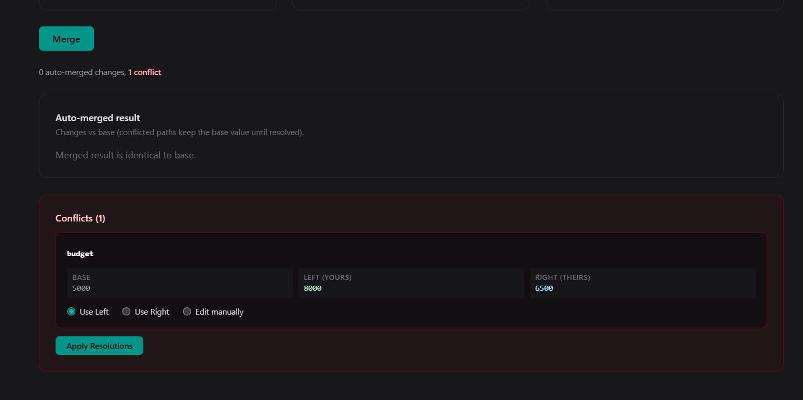

# DiffAtlas
🔗 **[Live Demo](https://diff-atlas-pro.vercel.app)**


Structural and visual diffing for data files — JSON, YAML, CSV, and images — 100% client-side.

## Problem Statement

Config files, datasets, and screenshots change constantly, yet most diff tools only understand lines of text, and visual tools make you upload sensitive files to a server. DiffAtlas fills that gap with structural and perceptual diffing for data files that runs entirely in your browser — nothing is ever uploaded, so even private configs and screenshots stay on your machine.

## Features

- Structural JSON diff with LCS-based array comparison, id/key matching, and type-change detection
- Fuzzy/key-based CSV row matching with a virtualized table view for large files
- Perceptual image diff (pixel mask + block regions) with side-by-side, overlay, and diff-mask views
- Three-way merge with conflict resolution (Use Left / Use Right / manual edit)
- Web Worker-powered so large files don't freeze the UI
- RFC 6902 JSON Patch export (copy to clipboard)
- PDF export of diff reports, including image diff masks
- Shareable URLs with no backend (compressed `#d=` hash link)
- Local diff history (IndexedDB, one-click reload)

## Tech Stack

- Vite + React 19 + TypeScript (strict)
- Tailwind CSS v4 (compiled at build time, no CDN)
- Vitest for unit tests, GitHub Actions for CI
- papaparse — CSV parsing
- js-yaml — YAML parsing
- jsPDF (dynamically imported, code-split) — PDF reports
- lz-string — shareable URL compression
- @tanstack/react-virtual — virtualized CSV rows

## Screenshots

> Placeholders — actual screenshots will be added here.






## Setup

```bash
npm install      # install dependencies
npm run dev      # start the dev server
npm run build    # typecheck + production build
npm run test     # run the Vitest suite
```

Requires Node.js >= 20 (see the `engines` field in `package.json`).

## Architecture

DiffAtlas uses a plugin-based diff engine: every file type implements a small shared `DiffPlugin` interface (`matches` for detection, `diff` for comparison) and registers itself in a central registry that maps file type → plugin, so adding a format means adding one file plus one registry line instead of touching UI code. The React layer stays type-agnostic — it renders the shared `DiffResult` shape (a tree view for JSON/YAML, a virtualized table for CSV, canvases for images) — while heavy text diffs run in a Web Worker behind a `useDiffWorker` hook, and YAML simply parses to an object and reuses the exact JSON structural diff rather than duplicating it.
